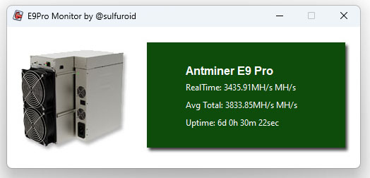

# e9pro_monitor
Python Script to monitor the ANTMINER E9PRO

You have to install Python 3.10 or Python3.11
This has been tested with windows

You need to update e9pro.cfg to add username, password and ip adress

If you want to reward my ETC wallet adress is: 0x46566378a77EcEE2d4d263Cdb0DD07245031CED0
Have fun
